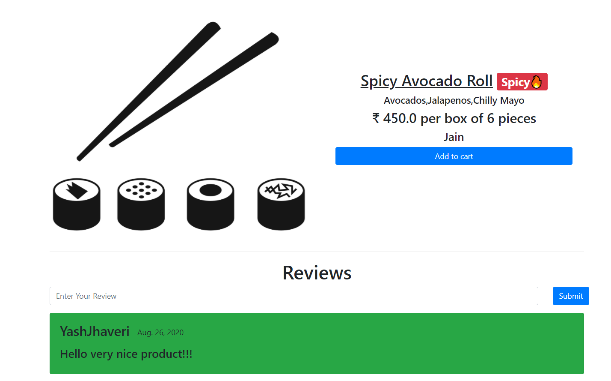
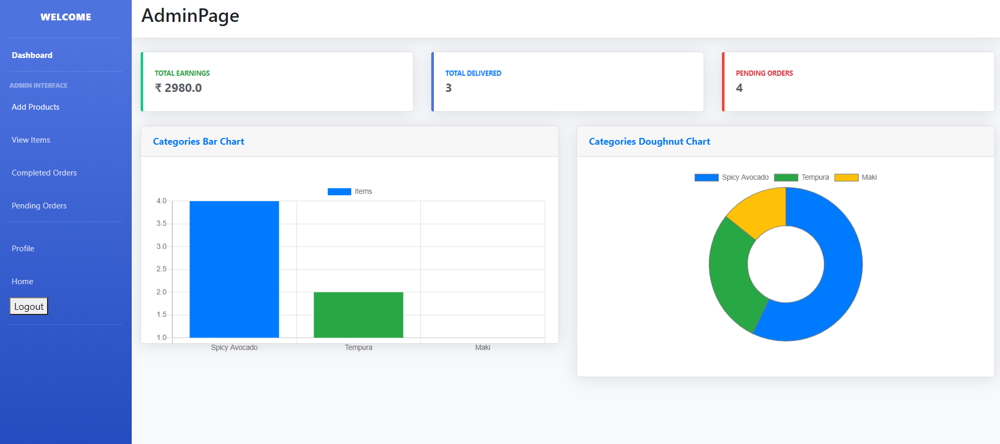
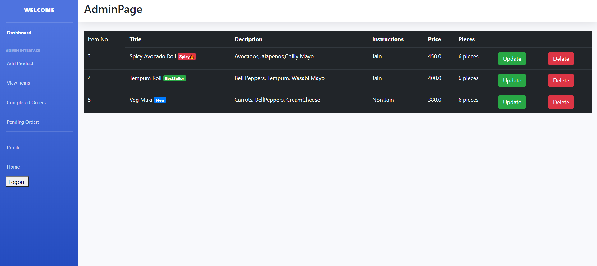
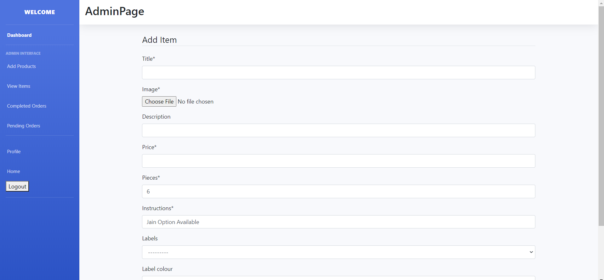
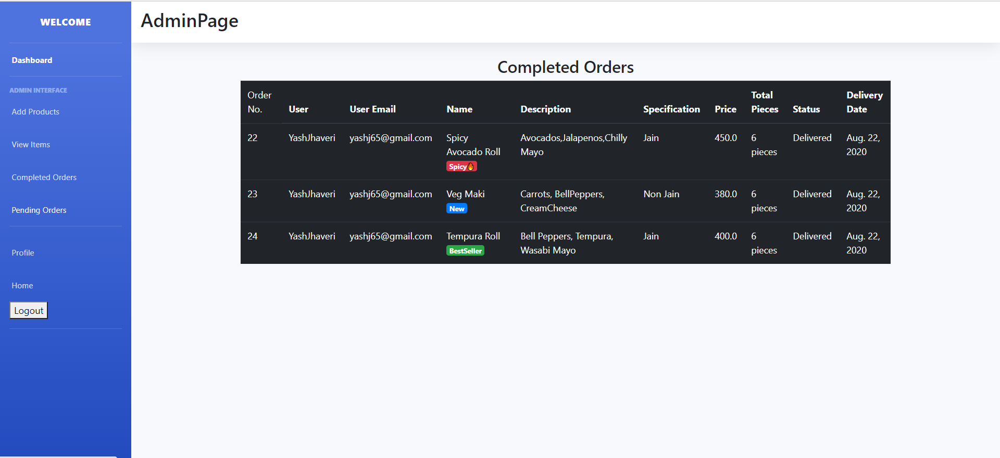
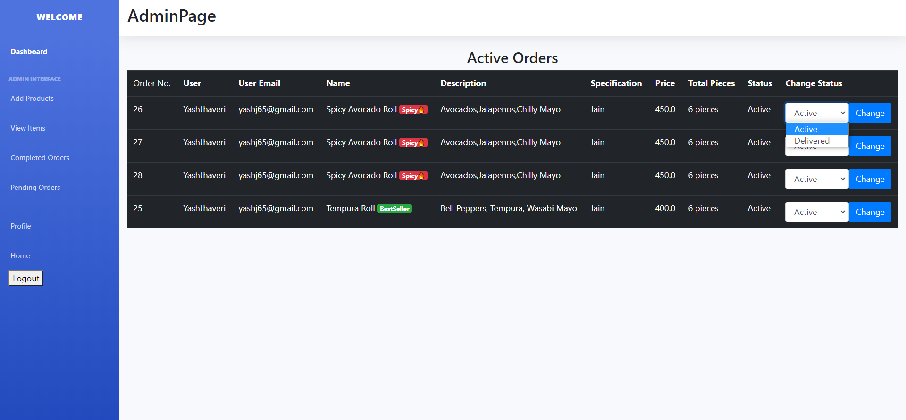

# E-Food

> Food E-Commerce Website where users can place orders and the admin can prepare and deliver them accordingly. 

# Requirements

> Python 3.7.7 
> Django 3.0.4 
> Django-Crispy-Forms 1.9.0 
> Pillow 7.0.0 

# Features

> Signup and Login based on whether you are the owner or customer

## Customer Login
> View Products 
> Add Items to Cart 
> Order Added Cart Items 
> Add reviews to the products

## Owner Login
> Can Add New Items 
> Can Update/Delete Existing Items 
> Can keep a list of all completed and pending orders 
> Can change the order status of a particular order 
> Has Dashboard where total income,total orders completed and total pending orders can be viewed along with the graph of the most ordered products

# Overview Of The Website

Home Page

 
 

Dish Detail Page

 

Login

 

SignUp

 

Buyer Login Navbar

 

Buyer Cart View

 

Buyer Order View

 

Admin Login Navbar

 

Admin Dashboard

 

Admin Item List

 

Admin Add New Item

 

Admin Completed Orders

 

Admin Pending Orders

 

> Clone the repository. 
> Install django and other required dependencies.Also make sure to have installed Python and Pip. 
> Run 'python manage.py runserver' in the command line to run the website on local host.

## App Info

### Author [Yash Jhaveri](https://www.linkedin.com/in/yash-jhaveri-3b0882192/)
